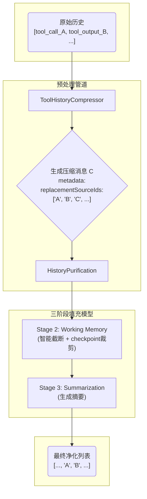

# Agent Context Manager 架构文档 (v4.3 - Fence-first 上下文注入)

`packages/linnkit/src/context-manager/*` 是 Agent 平台内部的通用上下文子系统。

这份 README 记录当前 `Agent Context Manager` 的权威架构说明：

- `shared/*` 放共享的上下文 pipeline、预处理器、摘要与格式化能力
- `profiles/agent/*` 放 Agent profile 的上下文构建、工作记忆、事件转换与任务能力
- `profiles/chat/*` 放 Chat 兼容层的对应实现（历史遗留，不是长期主方向）

> **2026-04-21 定稿口径**
>
> - 长期目标是 **agent-only core**：统一一套 agent pipeline
> - 纯聊天只是 **不注册工具、不给执行能力的 agent 形态**
> - `profiles/chat/`* 当前保留为**历史兼容层**；除兼容迁移和回归修复外，不再作为一等模式持续扩张

本文重点是 **Agent profile 的详细上下文构建机制**。三阶段模型、示意图、协议不变量和工具组一致性规则以当前实现为准；`profiles/chat/`* 仅作为过渡兼容轨道理解。

---

## 上下文窗口概念模型

### Context Injection 与 FenceRegistry

Agent profile 支持通用的 `context_injection` 消息类型，用来承载 host 注入的上下文。framework 只理解通用协议：

- `metadata.fenceKind`：host 注册的 fence kind
- `metadata.fenceAttrs`：formatter 需要的结构化属性
- `metadata.fencePlacement`：注入位置

具体标签由 host 的 `FenceRegistry` 决定。例如 Linnya 在 host 层注册 `additional-context`、`project-context`、`document-context`、`user-quote`，而 Linnsy 可以注册 `memory-context`、`system-event`、`subagent-summary`、`user-interjection`。这些标签字面都不属于 framework。

`BaseAgentTask` 只展开 `request.fences`，不再拼接产品字段。接入方应在进入 linnkit 前把自己的请求字段转换为 `FenceInjection[]`，并在 formatter 侧传入同一个 registry。

> 以下是发送给 LLM 的 messages 数组的直观分层结构，是所有预处理和 Provider 编排后的最终产物。
> 由 `profiles/agent/context/AgentContextManager.ts` 产出，消息按 **类型分组 + 组内时序** 排列。

### 有 Checkpoint 时（长程任务的典型状态）

```text
┌─────────────────────────────────────────────────┐
│  [system prompt]                                │ ← 静态，可缓存（Must-Keep）
├─────────────────────────────────────────────────┤
│  [context_injection fences]                     │ ← host 注册的上下文注入（如有）
├─────────────────────────────────────────────────┤
│  [checkpoint 前保留的 2 组工具交互]                │ ← 过渡上下文，防止完全断裂
│    tool_calls → tool_output(s)                  │   一组 = 一条 assistant.tool_calls
│    tool_calls → tool_output(s)                  │   及其全部 sibling tool_output
├─────────────────────────────────────────────────┤
│  [checkpoint 工具组]                             │ ← summary + TaskState 快照
│    assistant: context_checkpoint(...)           │   agent 的 2-5 句过渡摘要
│    tool: { _type, summary, taskstate }          │   可选携带 TaskState 完整数据
├─────────────────────────────────────────────────┤
│  [checkpoint 之后的所有消息]                      │ ← 不做裁剪，仅受 token 预算约束
│    taskstate_write(...)                         │   阶段内状态更新
│    tool_calls → tool_output                     │
│    ...                                          │
│    最新 user_input                               │
│    当前轮工具交互...                              │
└─────────────────────────────────────────────────┘
```

### 无 Checkpoint 时（短对话或 checkpoint 前的状态）

```text
┌─────────────────────────────────────────────────┐
│  [system prompt]                                │ ← 静态，可缓存（Must-Keep）
├─────────────────────────────────────────────────┤
│  [context_injection fences]                     │ ← host 注册的上下文注入（如有）
├─────────────────────────────────────────────────┤
│  [history_summary]                              │ ← 仅当 SummarizationProvider 触发过
├─────────────────────────────────────────────────┤
│  [对话历史 + 工具交互]                            │ ← 按优先级填充（反向）
│    旧对话 user↔assistant（P2）                   │
│    旧工具交互（P3，历史段最多 12 组）               │
│    最近 2 组原始工具交互（P1，最高优先级）           │
│    当前 user_input（Must-Keep）                  │
│    当前轮工具交互组（不限组数，仅受预算约束）          │
└─────────────────────────────────────────────────┘
```

> **关键设计决策：checkpoint 不生成 `history_summary`**
>
> Checkpoint 被视为**正常工具调用**，以 `tool_calls → tool_output(s)` 的形式按时序保留在历史中。
> Agent 调用 `context_checkpoint(summary, taskstate?)` 时写入的过渡摘要（2-5 句话）就在工具调用参数里，
> AI 下一轮可以直接看到这个工具组。工具调用记录本身就是摘要锚点，无需额外的 system 摘要消息。
>
> TaskState 不做热注入。它作为 `taskstate_write` 或 `context_checkpoint` 的工具组留在上下文中，AI 直接可见。
> Checkpoint 后 AI 看到的完整信息链为：
> **checkpoint 工具组（过渡摘要 + TaskState 快照）+ 最近工具交互（连续性）→ 完整接班**。

> **Checkpoint 时序说明**
>
> 1. `tick N`：LLM 返回 `tool_calls: [context_checkpoint(...)]`，系统执行工具，产生 `tool_output`，写入 history。
> 2. `tick N+1`：系统重新构建 messages 时，history 中已包含 checkpoint 的 `tool_calls + tool_output`。
>   `CheckpointSummarizationProvider` 检测到 checkpoint，裁剪其之前的旧历史，然后将裁剪后的 messages 发给 LLM。
>
> 也就是说：**AI 看到 checkpoint 的 `tool_output` 时，旧历史已经被裁掉了**。不存在“先看到 output、再裁剪”的中间态。
> 一次 tick 就是一轮完整 LLM 请求，AI 不会在两次请求之间单独“收到”任何消息。

---

## 核心架构：预处理 + 三阶段模型

本架构将上下文构建分为两大步骤，实现职责分离：

1. 预处理管道：先规整、压缩和净化消息
2. 三阶段智能填充：在 token 预算内智能保留、截断和摘要

### 事件进入上下文的不变量（2026-03 权威口径）

当前 Agent Context 的准入规则已经改为显式事件语义：

- 允许进入下一轮 LLM 上下文的工具事件：
  - `tool_call_decision` → 转成 `assistant.tool_calls`
  - `tool_output` → 转成 `tool`
- 明确禁止进入下一轮 LLM 上下文的事件：
  - `tool_process`
  - `todo_updated`
  - `subrun_trace`
  - hidden `user_input`
  - 空的终态 `thought / final_answer`
- `ephemeral` 在本模块里**不参与上下文准入判断**
  - 它只表示“是否允许持久化”
  - 上下文过滤统一由 `packages/linnkit/src/runtime-kernel/events/eventGovernance.ts` 的 `shouldEnterAgentContext(...)` 决定

### SDK 统一后的上下文语义

Agent Context 已经不再接受“按 SDK 分叉消息协议”的做法。

统一规则：

- 无论消息来自 OpenAI-compatible、Claude 还是 MiniMax
- 进入上下文前都必须先收敛成同一套 `AiMessage`
- 回放时都必须遵守同一套：
  - `assistant.tool_calls`
  - `tool`
  - `reasoning_details`
  - provider sidecar metadata

这意味着：

- Claude / MiniMax 可以继续通过 Anthropic Messages 协议提供 `thinking_blocks`
- 但这些 provider sidecar 只能作为 replay metadata / `reasoning_details` 存在
- `AgentWorkingMemoryProvider`、摘要链路、历史净化链路都不应该感知 Anthropic 私有执行语义

### 与 replay / UI 的边界

- `tool_call_decision` 是历史事实锚点，因此必须允许 replay，且下一轮仍可进入上下文
- `tool_process` 只服务实时 UI 投影，即使未来某些场景把它落库，也不能因此放行到上下文
- `tool_call_id` 继续作为 `tool_call_decision ↔ tool_output` 配对与前后端归并的稳定锚点

### 测试归属

`packages/linnkit/src/context-manager/profiles/agent/`* 的测试统一按 `product regression` 解释，不再作为 kernel 独立证据。

原因很直接：

- 这里验证的是 Linnya 当前的消息编排、工具组压缩、摘要净化、working memory 策略
- 它们属于 product context orchestration，而不是 runtime kernel 本体

当前代表性回归：

- `profiles/agent/context/providers/__tests__/multiToolFollowup.integration.test.ts`
  - 锁多工具 follow-up 在压缩、working memory、history purification 之间的产品语义闭环
  - 同时锁真实 `reasoning_details` 穿过三阶段后仍挂在同一条 `assistant(tool_calls)` 上
- `profiles/agent/preprocessors/__tests__/toolReplayProtocolGuard.test.ts`
  - 锁 DeepSeek 这类 provider 的历史工具组协议守卫：缺真实 sidecar 只能降级为文本，不能从 thought 伪造
- `profiles/agent/preprocessors/__tests__/toolHistoryCompressor.test.ts`
  - 锁工具组原子压缩与 `replacementSourceIds` 语义
- `profiles/agent/context/providers/__tests__/agentWorkingMemoryProvider.toolLimit.test.ts`
  - 锁当前产品 working memory 的工具组预算策略

中文备注：

- 这些测试是产品正确性护栏
- 不是 kernel verification set

---

## 第一步：预处理管道 (`shared/preprocessors/*` + `profiles/agent/preprocessors/*`)

**目标**：在进入核心构建逻辑前，对原始消息列表进行规整、清洗和优化。

### 1. `ToolHistoryCompressor`

**先执行**。负责将**历史段**中的完整**工具交互组**压缩为单条 `final_answer` 消息。

#### 工具交互组定义

- 一条 `assistant.type === 'tool_calls'` 是组锚点
- 该消息中的全部 `tool_call.id` 与其全部 sibling `tool_output` 共同构成一个原子组
- 压缩决策只能是“整组保留”或“整组压缩”，禁止按单个 `tool_output` 做部分替换

#### 关键实现

- 新消息通过 `metadata.replacementSourceIds` 记录整组被替换掉的原始消息 ID
- 同时补充：
  - `compressedToolCallIds`
  - `compressedToolNames`
  - `toolInteractionGroupSize`
  - `containsCheckpoint`

#### 同一 run 内的循环为何不压当前轮工具消息

在图执行引擎中，每一次 `tick` 都会调用 `AgentMessageOrchestrator`，并完整走一遍：

- 预处理管道
- 三阶段上下文构建

`ToolHistoryCompressor` 的“历史/当前轮次”切分边界是：

- 从后向前找到最后一条 `type === 'user_input'` 的消息
- 其之前视为“历史段”
- 其之后视为“当前轮次段”

因此：

- 用户发起新请求那一次：最后一条 `user_input` 是本轮新问题，其之前的旧工具交互落在“历史段”，会被压缩
- 同一个 run 内多次工具调用循环：通常不会产生新的 user 消息，最后一条 `user_input` 仍是本轮起点；run 内新产生的 `tool_calls/tool_output` 都位于该 `user_input` 之后，属于当前轮次段，被刻意保护不压缩

#### Checkpoint 特殊保护

- 当历史段中存在 checkpoint 工具组时，压缩器会额外保留最近一组 checkpoint 工具组
- 同时仍保留最近 2 组非-checkpoint 原始工具交互
- 其余更旧工具组继续压缩

目的：既保证 `CheckpointSummarizationProvider` 可识别 checkpoint，又不破坏常态工具历史压缩策略。

### 2. `ToolReplayProtocolGuard`

**压缩后、净化前执行**。它不是根因修复，而是协议保险：

- 正向链路必须先保证真实 `reasoning_details` 从 LLM 响应进入 assistant 产出事件：
  - 工具决策：`tool_call_decision.payload.reasoning_details`
  - 最终回答：`final_answer.reasoning_details`
- 回放时再进入对应 `AiMessage.metadata.reasoning_details`
- 最后由 `formatAgentLlmMessages(...)` 放回 `assistant(tool_calls)` 或 `assistant(final_answer)` 消息

当下游显式注入的 provider 策略要求工具 replay 必须有 reasoning sidecar（例如 DeepSeek thinking 模式）时，守卫只处理**已经进入历史轮次**的完整工具组：

- 有真实 `metadata.reasoning_details`：保持结构化 `assistant(tool_calls) + tool` 回放
- 缺真实 `metadata.reasoning_details`：按 host 策略处理，可降级成普通文本历史，也可保留结构并打 `provider_empty_replay_field` 通用标记
- 当前轮次工具组不在这里降级，避免掩盖“新链路丢 sidecar”的根因

注意：独立 `thought` 或 `<think>` 文本不是 provider replay sidecar，不能被折回去伪造 `reasoning_content`。

`linnkit` 不根据 `model_id` / provider 名称内置任何厂商判断。宿主应在组装 `AgentMessageOrchestrator` 或 `PreprocessorPipeline` 时，通过 `toolReplayProtocolPolicy` / `resolveToolReplayProtocolPolicy` 显式传入策略。

### 3. `HistoryPurification`

**随后执行**。负责根据最新摘要中的 `replacedMessageIds` 列表，移除所有已被摘要覆盖的旧消息。

关键实现：

- 不只移除 ID 在列表中的消息
- 还会检查消息的 `replacementSourceIds`
- 如果一个压缩消息的来源 ID 在净化列表中，那么这个压缩消息本身也会被一并移除，实现“自我吞噬”闭环

中文备注：

- `HistoryPurification` 是 shared 模块，由 chat 和 agent 共用

---

## 第二步：三阶段智能填充模型 (`profiles/agent/context/`*)

**目标**：在给定 token 预算内，通过选择、截断和摘要，生成发送给 LLM 的最优消息组合。

### 阶段一：核心上下文保留层 (Must-Keep)

始终无条件保留三部分：

1. 系统提示词 `system_prompt`
2. 用户当前请求 `current_user_request`
3. 标记为 must-keep 的 `context_injection` fence
  - `role` / `placement` / `lifetime` 由 host 注册的 `FenceRegistry` 决定
  - framework 只识别 `metadata.fenceKind` 和 `metadata.fencePlacement`
  - 具体标签字面（如 `<additional_context>`）属于 host，不属于 linnkit core

#### 极端情况

如果 Must-Keep 自身超预算，系统将采取截断策略：

- 保持系统提示词和用户输入不变
- 仅对允许截断的 fence 进行截断
- 每种 fence 的预算上限由 `FenceDescriptor.maxBudgetFraction` 或 host 的 `MustKeepPolicy` 决定

该阶段由 `AgentCoreContextProvider` 负责实现。

### 阶段二：工作记忆填充层 (Working Memory)

采用**工具优先填充策略**，使用所有剩余预算，从最新消息开始反向填充，直到预算耗尽。

#### P1：工具交互组保留

##### P1-Checkpoint（工具锚点裁剪）

当历史中检测到最近一次 `context_checkpoint` 工具组时，将其视为上下文锚点：

- checkpoint 之前：
  - 保留 Must-Keep
  - 保留 checkpoint 工具组本身
  - 保留 checkpoint 之前最近 2 组完整工具交互
  - 其余更老历史全部裁剪
- checkpoint 之后：
  - 不做裁剪，保证后续工具调用和推理自然推进

checkpoint 仍是**正常工具调用**，不会生成 system 摘要，也不会以 `history_summary` 注入到最前。

##### 最近工具组原子保留

- 识别最近的 2 组原始工具交互，标记为最高优先级
- 实现按组保留，确保 assistant 锚点与全部 sibling `tool_output` 一起进入上下文

##### 范围说明

- 同一轮 user 之后产生的工具组：默认不做数量上限裁剪，只受 token 预算约束
- user 之前的历史段：仍然只保留最近 2 组原始结构工具交互，避免历史工具消息膨胀

#### P2：核心对话

处理纯文本对话（`user`, `assistant`）以及可能存在的最新摘要。

此时收到的数据已经过预处理，不再负责摘要筛选和去重。

#### P3：历史工具交互

处理第 3 组及以前的较老工具交互记录。

- 硬上限：对最后一条 `user_input` 之前的历史工具交互，最多只保留 12 组
- 压缩工具摘要识别：
  - 预处理阶段被压缩成 `role: 'assistant'`
  - 且 `metadata.isCompressedToolHistory === true`
  - 这类消息在 working memory 中也算一组工具交互，同样受 12 组上限约束

注意：P3 的 12 组上限只作用于历史段，不会裁剪同一轮 user 之后的工具组。

#### 工具截断策略

单次 run 内默认行为：

- 工具组 `tool_calls ↔ tool_output(s)` 结构永远整组保留
- 当 token 不足或工具输出过大时，只允许做组内 `tool_output` 摘要/截断
- 不得打散 assistant 锚点与 sibling outputs 的结构

触发条件：

- 当一个工具交互组因为返回结果过大而超出 `MAX_TOOL_PAIR_TOKENS`（默认 6,000 tokens）
- 这是上下文构建期对整组 `tool_calls + tool_output` 的 token 预算兜底，不是 ToolNode 执行期的 observation 落盘阈值

收益：

- 避免单次 run 内工具链断裂
- 避免 Agent 因丢失最近行动结果而“失明”或陷入循环

该阶段由 `AgentWorkingMemoryProvider` 负责实现。

辅助模块位于 `profiles/agent/context/providers/working-memory/`*：

- `ToolPairMatcher`
- `ToolPairTruncator`
- `ReplacementSourceTagger`

### 阶段三：历史摘要触发 (Summarization Trigger)

内容：

- 工作记忆中最早的一部分核心对话
- 旧的 `history_summary`

职责：

- 当 working memory 填充后，若 token 占用率依然过高，则触发此阶段
- 调用 LLM 生成新的摘要消息，取代最旧的一段对话历史

关键实现：

- 通过 `SummarizationStateUtils.collectReplacedIds`
- 收集所有被替换消息的 ID
- 包括那些通过 `replacementSourceIds` 追溯到的原始 ID

摘要策略：

- 当前实现**不包括**
  - 工具交互 `tool_calls / tool_output`
  - 思考过程 `thought`
- 让摘要更聚焦用户与 AI 之间的对话主线

ID 范围锚点：

- `replacesStartMessageId`
- `replacesEndMessageId`

该阶段由 shared 的 `SummarizationProvider` 负责实现。

---

## 核心数据流与 `replacementSourceIds`

我们最终实现的核心是 `metadata.replacementSourceIds` 这一数据契约。它贯穿整个上下文构建流程，解决因消息合并/压缩导致原始 ID 丢失的问题。

这里有一个重要边界更新：

- `replacementSourceIds` 只记录**当前消息真实替代或代表的工具组 source ids**
- 不再向相邻 `user_input / final_answer` 扩散
- 因此后续 `history_summary` 只会递归收集真正被替换的工具历史，不会再顺手吞掉无关文本对话




生产者：

- `ToolHistoryCompressor`
- `AgentWorkingMemoryProvider`

消费者：

- `CheckpointSummarizationProvider`
- `SummarizationProvider`
- `HistoryPurification`

这个机制保证无论消息经过多少次变换，其最原始的身份信息都不会丢失，从而实现精确、可靠的历史净化。

---

## 关键文件职责

### `profiles/agent/tasks/BaseAgentTask.ts`

统一 Agent 任务接口。核心 `buildMessages()` 方法负责将：

- 用户请求
- 工具描述
- 上下文文档
- 历史消息

组装成一份**原始、完整且时序正确**的消息列表。

### `profiles/agent/orchestration/AgentMessageOrchestrator.ts`

作为数据准备调度中心，完整编排：

- 事件转换
- 任务构建
- 预处理管道
- 上下文优化

### `profiles/agent/context/AgentContextManager.ts`

上下文优化核心实现。它接收预处理后的消息列表和 token 预算，通过编排各 Provider，生成预算约束下的最优消息组合。

### `profiles/agent/context/ConversationSession.ts`

由 `AgentMessageOrchestrator` 临时创建的纯内存消息容器，用于把消息列表传给 `AgentContextManager`。

### `shared/MessageFormatter.ts`

负责最终“出关”：

- 将 `AiMessage` 翻译成 LLM API 能完全理解的标准格式
- 这是确保工具调用、附加上下文和 provider sidecar 信息被正确传递的关键

---

## 事件转换层：`eventConverter` vs `eventMappers`

系统中存在两个事件转换模块，各自职责不同。

### `profiles/agent/utils/eventConverter.ts`

局部数据准备转换器。

职责：

- `RuntimeEvent[] -> AiMessage[]`
- `AiMessage -> RuntimeEvent`

使用场景：

- 仅用于 context manager 内部
- 负责历史记录进入上下文构建前的数据准备

关键点：

- 正确映射摘要元数据字段
- 正确映射 `tool_call_decision / tool_output`
- 统一过滤 `tool_process`

### Runtime Kernel 侧 `eventMappers`

运行时事件流映射器。

职责：

- `AnyAgentEvent -> SSEEvent`
- `AnyAgentEvent -> RuntimeEvent`

使用场景：

- Graph 执行主链路的输出侧
- 服务于实时推送和持久化

总结：

- `eventConverter` 处理批量、静态的历史数据
- `eventMappers` 处理单个、动态的实时事件

---

## 文件结构

```text
packages/linnkit/src/context-manager/
├── README.md
├── index.ts
├── __tests__/
│   ├── history-purifier-refactor.test.ts
│   ├── summary-id-mapping.test.ts
│   └── summary-purification-integration.test.ts
├── shared/
│   ├── MessageFormatter.ts
│   ├── checkpointMarker.ts
│   ├── context-manager-base.ts
│   ├── context-pipeline.ts
│   ├── context-result.ts
│   ├── index.ts
│   ├── preprocessors/
│   │   ├── __tests__/userQuoteLifetime.test.ts
│   │   ├── base.ts
│   │   ├── historyPurification.ts
│   │   ├── index.ts
│   │   └── userQuoteLifetime.ts
│   ├── providers/
│   │   ├── base.ts
│   │   ├── index.ts
│   │   ├── registry.ts
│   │   └── SummarizationProvider.ts
│   └── summarization/
│       ├── index.ts
│       ├── AISummaryGenerator.ts
│       ├── SummarizationCandidateSelector.ts
│       ├── SummarizationStateUtils.ts
│       └── SummarizationTrigger.ts
├── profiles/
│   ├── agent/
│   │   ├── config.ts
│   │   ├── contracts.ts
│   │   ├── orchestration/AgentMessageOrchestrator.ts
│   │   ├── context/
│   │   │   ├── AgentContextManager.ts
│   │   │   ├── ConversationSession.ts
│   │   │   ├── config.ts
│   │   │   ├── index.ts
│   │   │   └── providers/
│   │   │       ├── AgentCoreContextProvider.ts
│   │   │       ├── AgentWorkingMemoryProvider.ts
│   │   │       ├── CheckpointSummarizationProvider.ts
│   │   │       ├── __tests__/
│   │   │       │   ├── agentWorkingMemoryProvider.toolLimit.test.ts
│   │   │       │   ├── checkpointSummarizationProvider.test.ts
│   │   │       │   └── multiToolFollowup.integration.test.ts
│   │   │       ├── base.ts
│   │   │       ├── index.ts
│   │   │       └── working-memory/
│   │   │           ├── index.ts
│   │   │           ├── ReplacementSourceTagger.ts
│   │   │           ├── ToolPairMatcher.ts
│   │   │           ├── ToolPairTruncator.ts
│   │   │           └── types.ts
│   │   ├── preprocessors/
│   │   │   ├── __tests__/toolHistoryCompressor.test.ts
│   │   │   ├── base.ts
│   │   │   ├── index.ts
│   │   │   └── toolHistoryCompressor.ts
│   │   ├── tasks/
│   │   │   ├── BaseAgentTask.ts
│   │   │   └── base.ts
│   │   ├── tools/ToolManager.ts
│   │   └── utils/
│   │       ├── __tests__/
│   │       │   ├── eventConverter.test.ts
│   │       │   ├── gemini-thought-signature.test.ts
│   │       │   └── replayHarness.test.ts
│   │       ├── eventConverter.ts
│   │       ├── index.ts
│   │       ├── toolInteractionGroup.ts
│   │       └── toolOutputSummarizer.ts
│   └── chat/
│       ├── config/defaults.ts
│       ├── contracts.ts
│       ├── request-adapters.ts
│       ├── orchestration/MessageOrchestrator.ts
│       ├── context/
│       │   ├── ContextManager.ts
│       │   ├── config.ts
│       │   ├── index.ts
│       │   └── providers/
│       │       ├── base.ts
│       │       ├── CoreContextProvider.ts
│       │       ├── index.ts
│       │       └── WorkingMemoryProvider.ts
│       ├── preprocessors/
│       │   ├── base.ts
│       │   ├── index.ts
│       │   └── toolHistoryFilter.ts
│       ├── tasks/
│       │   ├── BaseConversationalTask.ts
│       │   └── base.ts
│       └── utils/
│           ├── eventConverter.ts
│           ├── index.ts
│           └── messageAdapters.ts
```

---

## 项目 / 文档 / 工作区上下文注入策略

### 数据来源与字段约定

Agent profile 不再直接理解项目 / 文档 / 工作区字段。`BaseAgentTask.buildMessages()` 只展开 `request.fences`，每一条 fence 会变成通用的 `context_injection` 消息。

host 常见输入字段仍然可以存在，例如：

- `project_metadata`
- `document_metadata`
- `document_fragment`
- `context_before` / `context_after`
- `user_quote`
- 可选的项目文件列表或工作区结构信息

但这些字段必须先由 host 适配层转换为 `FenceInjection[]`，再交给 linnkit。framework 不再为这些字段定义表达层语义。

术语约定：

- 对用户与提示词层面统一使用 **project**
- `workspace_nodes` 只作为 host 实现细节，不单独暴露为 framework 协议层级概念

### Host 如何构建这些上下文

以 Linnya 为例，host 会注册自己的 fence 家族：

- `additional-context`：持久化补充上下文，通常放在 system 之后
- `project-context`：单轮项目上下文
- `document-context`：单轮文档上下文
- `user-quote`：单轮用户选区引用
- `review-context`：review agent 使用的审阅上下文

这些 fence 的 formatter 可以输出 host 自己需要的标签，例如：

- `<project_context> ... </project_context>`
- `<document_context> ... </document_context>`
- `<user_quote> ... </user_quote>`

标签、中文前缀、属性名、生命周期都由 host 注册表决定；linnkit 只负责预算、排序、生命周期和最终格式化调度。

### MessageFormatter：`context_injection` → registry formatter

最终在调用 LLM 前，所有 `AiMessage` 会经过 `shared/MessageFormatter.ts` 统一“出关”。

对于 `type: 'context_injection'`：

```ts
const descriptor = registry.get(metadata.fenceKind);
return {
  role: descriptor.llmRole,
  content: descriptor.formatter(content, metadata.fenceAttrs ?? {}),
};
```

也就是说：

- framework 不硬编码 `document_fragment`
- framework 不硬编码 `<additional_context>` 或任何 host 标签
- `task_request` / `task_completion` 等 framework 协议消息只做纯透传

设计意图：

- framework 负责通用上下文工程：预算、排序、生命周期、摘要、工具组一致性
- host 负责产品表达：标签、中文说明、项目/文档/引用等业务字段如何呈现给 LLM
- 这样 linnkit 可以作为框架复用，而不是把 Linnya 的产品语义写进 core

---

## 协议治理与不变量

这部分是当前 `agent` context manager 的权威协议说明。以后修改 `eventConverter`、`AgentWorkingMemoryProvider`、摘要链路或工具历史压缩逻辑时，以这里为准。

### 一、回放协议不变量

#### 1. `action` 进入 LLM 上下文时，只能代表 LLM 的工具决策锚点

- 允许进入回放的 `tool_call_decision` 只代表模型产生的 `assistant.tool_calls`
- `ToolNode` 产生的 `tool_process(start/update/complete/error)` 只是过程事件，不得进入下一轮 LLM 上下文
- 当前唯一稳定判定标准是 `meta.origin === 'tool_node'`

#### 2. 工具交互组必须保持原子性

最小工具交互必须包含：

- `assistant/tool_calls`
- `tool/tool_output`

约束：

- 如果 `tool_output` 被保留，但缺失对应 `tool_calls`，视为协议损坏
- 如果 `tool_calls` 被保留，但 `tool_call_id` 无法在同组 `tool_output` 中闭合，也视为协议损坏
- 压缩和 working memory 选择只能按组操作，不能拆出单个 sibling `tool_output`

#### 3. `payload.tool_calls` 是回放权威载荷

- 当 `RuntimeEvent(tool_call_decision).payload.tool_calls` 存在时，回放必须优先原样使用
- 不允许随意退回“按 `tool_name + args` 最小重建”的兼容写法，除非历史数据本身确实缺失 payload
- 原因是 Gemini/OpenRouter 等 provider 会在 `tool_calls` 内携带 `thought_signature`、`reasoning_details` 等关键字段
- 当一次模型决策包含多个工具调用时，`payload.tool_calls` 必须保存**整批**工具调用，而不是拆成多条独立 `tool_call_decision`

#### 4. replay 时不能丢 provider/protocol 关键字段

- `payload.tool_calls`
- `reasoning_details`
- `raw_output`

这些字段不是调试信息，而是回放、压缩和 provider 兼容链路的一部分。

字段落点约定：

- `RuntimeEvent(tool_call_decision).payload.reasoning_details` 与 `RuntimeEvent(final_answer).reasoning_details` 是运行时事实事件中的标准位置。
- `AiMessage(type='tool_calls' | 'final_answer').metadata.reasoning_details` 是上下文回放后的标准位置。
- `tool_calls[*].extra_content` 是工具调用自身的 provider 扩展载体，context-manager 不解析其中内容。
- `formatAgentLlmMessages(messages)` 是 Agent 模式推荐出关 helper，固定输出 native tools 形态，并把 `reasoning_details` 放回对应 assistant 消息。
- “保留最近 reasoning”不等于“可回放 provider sidecar”：DeepSeek 要求的是同一条 `assistant.tool_calls` message 上的原始 reasoning sidecar。
- `ToolReplayProtocolGuard` 只治理下游策略显式要求的、历史轮次中缺真实 sidecar 的工具组；它不能从 `thought` 或 `<think>` 推断出 `reasoning_content`。

注意：

- `raw_output` 留在 metadata 层，供 checkpoint 解析、审计和截断输入使用；LLM 请求体中的 `tool` 消息只会看到 `content`。
- `subrun_trace` 是 UI / 子过程侧车，不进入主 Agent 上下文，不能和 provider replay sidecar 混用。
- 被 `ToolHistoryCompressor` 压缩或被 `history_summary` 替换的旧工具组不再具备结构化 replay 能力，只保留摘要文本；最近保留的原始工具组必须完整保留这些字段。
- 如果 provider 要求 sidecar 且历史工具组缺失 sidecar，应由 host 注入策略决定：保守降级为文本历史，或打 `provider_empty_replay_field` 标记交给 provider codec 做空字段 legacy replay。

#### 5. `final_answer_chunk` 只属于流式过程，不属于历史事实

- chunk 可以进入实时展示，也可以进入 `StreamCollector`
- 真正进入持久化与回放事实链路的应是 `final_answer`
- 回放层不能把 chunk 当成历史消息源

### 二、上下文过滤不变量

以下事件默认不得进入 LLM 上下文：

- `todo_updated`
- `subrun_trace`
- `metadata.ui.presentation === 'hidden'` 的 `user_input`
- `meta.origin === 'tool_node'` 的 `action`
- 空内容的终态 `thought / final_answer`

治理要求：

- 这些过滤规则必须集中收敛在回放转换层，例如 `profiles/agent/utils/eventConverter.ts`
- 不要把过滤逻辑分散到各个 Provider 再各写一份

### 三、工作记忆与摘要不变量

#### 1. 工具组优先级高于纯文本对话

- 当前轮工具组优先于纯文本对话
- 近历史工具组优先于更旧工具组
- 纯文本消息不能挤掉最近工具锚点

#### 2. `replacementSourceIds` 只能指向真实替代来源

- 工具历史压缩消息上的 `replacementSourceIds` 只能记录该消息真实代表或替代的 source ids
- 禁止把相邻 `user_input / final_answer` 顺手并进去

#### 3. 摘要闭环必须依赖 `replacementSourceIds / replacedMessageIds`

- 压缩消息必须带 `replacementSourceIds`
- 后续生成 `history_summary` 时，`replacedMessageIds` 必须能覆盖这些来源
- `HistoryPurification` 必须能消费这套关系

#### 4. 最新摘要的权威选择应以 `summarySeq` 为主

- 范围锚点是历史兼容字段，不应继续扩散为主判定依据
- 后续若清理旧语义，应优先收敛到 `summarySeq + 精确 replacedMessageIds`

#### 5. checkpoint 识别应依赖稳定结构，而不是展示文案

- checkpoint 是结构化工具组，不是 UI 提示词
- 识别逻辑应基于稳定 marker、工具名和结构化载荷

### 四、代码评审清单

以后修改以下模块时，评审至少过一遍这份清单：

- `packages/linnkit/src/context-manager/profiles/agent/utils/eventConverter.ts`
- `packages/linnkit/src/context-manager/profiles/agent/context/providers/AgentWorkingMemoryProvider.ts`
- `packages/linnkit/src/context-manager/profiles/agent/preprocessors/toolHistoryCompressor.ts`
- `packages/linnkit/src/context-manager/profiles/agent/preprocessors/toolReplayProtocolGuard.ts`
- `packages/linnkit/src/context-manager/shared/preprocessors/historyPurification.ts`

必查项：

1. 有没有让过程事件误进入历史回放
2. 有没有绕开 `payload.tool_calls` 直接重建协议字段
3. 有没有把 UI/调试字段泄露到模型消息内容
4. 有没有破坏 `tool_calls + tool_output` 原子组
5. 有没有让 `replacementSourceIds` 指向不真实的替代来源
6. 有没有把普通 thought / `<think>` 文本伪造成 provider replay sidecar

### 五、最低回归要求

每次动到执行期协议、回放协议或上下文构建协议，至少跑这些测试：

- `src/app-hosts/linnya/adapters/flow/__integration-tests__/flow.followup-tool-history.integration.test.ts`
- `packages/linnkit/src/context-manager/profiles/agent/utils/__tests__/eventConverter.test.ts`
- `packages/linnkit/src/context-manager/profiles/agent/utils/__tests__/replayHarness.test.ts`
- `packages/linnkit/src/context-manager/profiles/agent/context/providers/__tests__/multiToolFollowup.integration.test.ts`

如果改动涉及中断、恢复、摘要或 checkpoint，还要额外跑：

- `src/app-hosts/linnya/adapters/flow/__integration-tests__/agentRunner.interrupted.integration.test.ts`

### 六、当前仍存在的语义债务

- Provider 与回放层之间仍依赖少量隐式命名契约，例如 `replacementSourceIds / replacedMessageIds`
- 后续改动必须同步补回归，并保持与 schema / 测试的一致性
