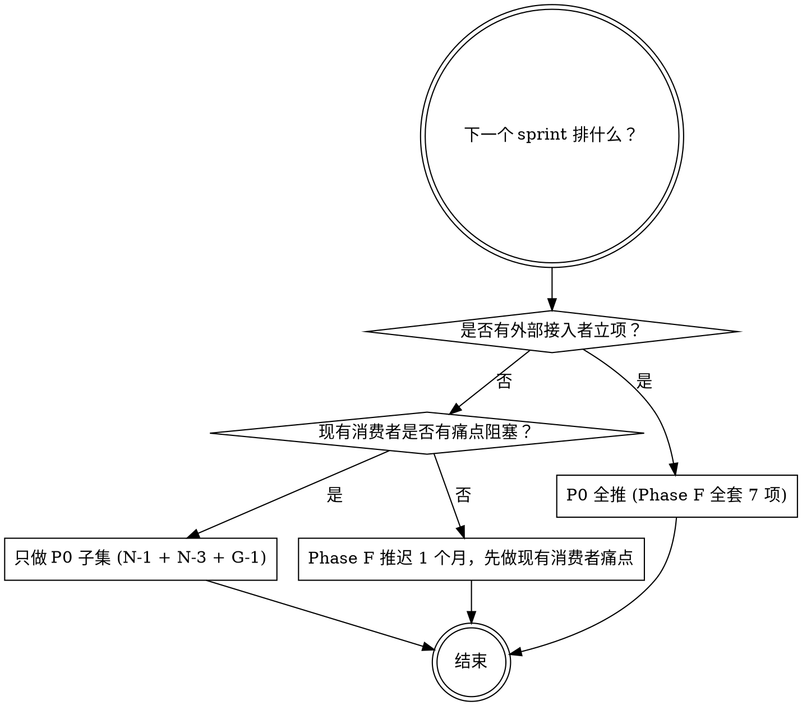

# 07 · ROI 排序的优先级清单

> 把 [`04`](./04-protocol-roadmap.md) 的协议层 + [`05`](./05-builtin-tools-protocol.md) 的通用工具 + [`06`](./06-developer-experience-roadmap.md) 的 DX 抓手 **按投入产出比排序**，给出"接下来 1-2 个 sprint 立刻要做的、3 个月内做的、半年到 1 年做的"三档。
>
> **本文按 framework 视角排序**，不替任何具体消费者排期；具体消费者的迭代节奏由各自产品文档自定。

---

## 1. 一句话推荐

> **如果只能挑 3 件事**：先做 **N-1 AgentSpec**、**N-3 RunSupervisor 本体**、**G-1 AuditEnvelope**。
>
> 这 3 件**解锁后续所有路线图**：协议层 N-2/N-4/N-5 都依赖 AgentSpec；任何后台/异步/长 run 形态都依赖 RunSupervisor；任何"出事时复盘"都依赖 AuditEnvelope。**且 3 件代价都是 1-2 人周**，ROI 最高。

---

## 2. ROI 矩阵

横轴：**实施成本**（人 · 周）；纵轴：**对外影响范围**。

### 2.1 P0（必做，不做就持续欠债）

| 项 | 成本 | 影响范围 | ROI | 不做的代价 |
|---|---|---|---|---|
| **N-1 AgentSpec** | 1 周 | 解锁 N-2/N-3/discovery/multi-tenant/SKILL；所有外部接入者第一周就需要 | ⭐⭐⭐⭐⭐ | 任何"agent 作为可注册资源"路线全卡 |
| **N-3 RunSupervisor 本体 + RunHandle v2** | 2 周 | 解锁 daemon / cron / 长 run / 子 run 树 | ⭐⭐⭐⭐⭐ | 任何后台 / 异步 / 长 run 形态硬阻塞 |
| **G-1 AuditEnvelope + AuditPort** | 1 周 | 所有"出事时复盘"场景 | ⭐⭐⭐⭐⭐ | 接入方第 1 周就要问"事故怎么查" |
| **5 分钟 quickstart** | 1 周 | 100% 接入方第 1 天体验 | ⭐⭐⭐⭐⭐ | 文档密度高也救不了上手成本 |
| **`linnkit-cli` v0**（init / run / replay） | 2 周 | 80% 接入方第 1 周就需要 | ⭐⭐⭐⭐⭐ | 接入流程靠手抄文档 |
| **chat 兼容收敛 + 删 `linnkitCompat`** | 1 周 | "agent-only core" 真正落地 | ⭐⭐⭐⭐ | 优雅性硬欠款，文档与代码两张皮 |

### 2.2 P1（3 个月内做）

| 项 | 成本 | 影响范围 | ROI | 备注 |
|---|---|---|---|---|
| **DevTools Web v0**（Event Timeline + Context Window） | 3 周 | 100% 接入方第 1 个月 | ⭐⭐⭐⭐⭐ | 依赖 G-3 |
| **G-3 Replay SDK** | 1 周 | DevTools 底座 + 测试 + 审计回放 | ⭐⭐⭐⭐⭐ | DevTools / 审计的共同依赖 |
| **N-4 MemoryPort + 1-2 参考实现** | 2 周 | 长期记忆 / 多 agent 共享 memory 场景 | ⭐⭐⭐⭐ | in-memory + markdown 两个参考实现 |
| **N-2 AgentMessageBus（进程内）** | 2 周 | 解锁 multi-agent / agent mesh | ⭐⭐⭐⭐ | actor 风格 + at-least-once |
| **G-2 CostLedger + QuotaPort** | 1 周 | 多租户 / cost 可控 | ⭐⭐⭐⭐ | 每月成本统计 / 限额 |
| **N-5 PermissionPort** | 1 周 | "接外部 / 多租户 / 自动化执行" 场景 | ⭐⭐⭐ | sandbox 后置；先 ask + 白名单 |
| **Test DSL** | 1 周 | 长期维护方 | ⭐⭐⭐⭐ | DX 加分 |

### 2.3 P2（半年到 1 年）

| 项 | 成本 | 影响范围 | ROI | 备注 |
|---|---|---|---|---|
| **wait_external 泛化** | 2 周 | 异步 / webhook / 子 run 完成回调 | ⭐⭐⭐ | 异步调度场景需要 |
| **Plugin 模板** | 1 周 | 扩展生态 | ⭐⭐⭐ | 第三方插件起步 |
| **N-5 SandboxPort** | 1 周（仅 port） | 接 sandbox 实现 | ⭐⭐ | 等具体场景 |
| **G-4 Redaction Port** | 1 周 | 多租户 PII / 隐私 | ⭐⭐ | 等真实需求 |
| **N-6 EventBusPort 跨进程化** | 2 周 | cluster 形态 | ⭐⭐ | Phase H 第一砖 |
| **分布式 Checkpointer** | 3 周 | cluster 形态 | ⭐⭐ | Phase H |
| **Agent discovery + capability 协商** | 2 周 | mesh 内寻址 | ⭐⭐ | Phase H |

### 2.4 框架级通用工具（**优先级显著靠后**）

> [`05`](./05-builtin-tools-protocol.md) 列的几件"框架级通用工具"是**协议层语法糖**，不是协议本身。**只有在对应协议层先稳定下来之后才有意义**——否则就是给一组未定型的协议加一层薄包装。
>
> 此外，**真正需要交互的能力不能用"工具调用工具"的方式串联**——比如"问用户一个问题"必须走 `wait_user` 协议级暂停，而不是包成一个 `request_user_input` 工具让模型链式调用。后者会破坏控制流可审计性。

| 项 | 成本 | 前置 | 优先级 |
|---|---|---|---|
| `todo`（写入 RuntimeEvent） | 0.5 周 | RuntimeEvent 已稳 | 可选，按需实现 |
| `context_checkpoint` | 0.5 周 | 摘要 marker 协议已稳 | 可选 |
| `delegate_to_agent` | 0.5 周 | child-run protocol + N-1 AgentSpec | 等 N-1 完成 |
| `memory_read` / `memory_write` | 1 周 | N-4 MemoryPort | 等 N-4 完成 |
| `skills_list` / `skills_load` | 1 周 | Skill / Plugin 协议（待立项） | 等协议立项 |
| ~~`request_user_input`~~ | — | — | **不做**（详见 [`05 §3`](./05-builtin-tools-protocol.md)） |

### 2.5 不做 / 已删除

| 项 | 原因 |
|---|---|
| `request_user_input` 工具 | 交互式能力必须走 `wait_user` 协议级暂停，不能用工具链方式实现 |
| 内置 `bash` / `web_search` / `read_file` | 业务工具，归宿主侧 |
| graph DSL / 节点 plugin | linnkit 不做"用户画图编排"路线（详见 [`01 §1`](./01-peer-comparison.md) 与 LangGraph 的对比） |

---

## 3. Phase 路线图

> 阶段名只用 framework 视角的版本号；具体上线时间由每个消费者自行排期。

### 3.1 Phase F（最近 1-2 个 sprint，**P0**）

> 主题：**通用化 + 易审计 + 易接入** 的最后一公里

| # | 项 | 估计 | 完成判据 |
|---|---|---|---|
| 1 | **N-1 AgentSpec 一等对象** | 1 人周 | `AgentSpec` schema 入 `linnkit/contracts`；`promptKey` / `mode` 退役为 `AgentSpec` 字段；codemod 把现有消费者 agent 自动迁移 |
| 2 | **N-3 RunSupervisor 本体 + RunHandle v2** | 2 人周 | 8 个核心方法实现；contract test 全绿；至少 1 个消费者主链路接入 |
| 3 | **G-1 AuditEnvelope + AuditPort** | 1 人周 | envelope schema；3 个 sample 实现（noop / file / OTel-shape）；至少覆盖"模型选择 / 工具拒绝 / fallback / wait_user / sandbox 决策"5 类事件 |
| 4 | **`linnkit-cli` v0**（init / run / replay） | 2 人周 | 3 个命令可用；`linnkit init my-agent` 生成可运行模板 |
| 5 | **5 分钟 quickstart** | 1 人周 | 30 行代码跑起 hello-agent，**不要求**理解 GraphExecutor / 依赖袋 / bridge |
| 6 | **chat 兼容收敛期启动**（B 阶段：现有调用迁到 tools-disabled agent；删 `profiles/chat/*`） | 1 人周 | 删完 + 全量回归绿 |
| 7 | **删 `linnkitCompat`** + root 入口里的迁移期 alias | 0.5 人周 | grep 全树无 `linnkitCompat` 引用 |

**Phase F 总成本**：~ 8.5 人周，2-3 人 1 个月可完成。

### 3.2 Phase G（接下来 3-6 个月，**P1**）

> 主题：**多 Agent + Memory + Permission + DevTools**

| # | 项 | 估计 | 完成判据 |
|---|---|---|---|
| 1 | **N-4 MemoryPort + KnowledgePort** | 2 人周 | port + 2 个参考实现（in-memory + markdown）；至少 1 个消费者接入 |
| 2 | **N-5 PermissionPort**（先白名单 + ask；sandbox 后置） | 1 人周 | port + ask 走 wait_user 协议；至少 1 个消费者接入 |
| 3 | **N-2 AgentMessageBus port**（进程内 actor 实现） | 2 人周 | port + in-process actor；至少 1 个 demo 跑通 orchestrator + worker |
| 4 | **G-2 CostLedger + QuotaPort** | 1 人周 | port + 1 个内置 ledger；按 run / 按 actor 累计 |
| 5 | **G-3 Replay SDK** | 1 人周 | `linnkit/replay` 子入口；可加载 EventStore + 重建 RunContext |
| 6 | **DevTools Web v0** | 3 人周 | Event Timeline + Context Window + Prompt Diff 三视图；可对接 Replay SDK |
| 7 | **session_key template 进 ports** | 1 人周 | port 接受多通道 / 多 peer 合成的 opaque key |
| 8 | **Test DSL** | 1 人周 | `defineAgentTest()` 链式 API；至少 5 个 case 改写示例 |

**Phase G 总成本**：~ 12 人周，2-3 人 1.5-2 个月。

### 3.3 Phase H（半年到 1 年后，**P2**）

> 主题：**集群 + 跨进程 + 跨节点**

| # | 项 | 估计 | 备注 |
|---|---|---|---|
| 1 | **N-6 EventBusPort 跨进程化** | 2 人周 | Redis / NATS 适配器 |
| 2 | **分布式 Checkpointer / EventStore** | 3 人周 | Postgres / SQLite-WAL-shared 之一 |
| 3 | **Agent discovery + capability 协商** | 2 人周 | gossip 或 registry-based |
| 4 | **wait_external 泛化** | 2 人周 | webhook / IM 回调 / 子 agent 完成 |
| 5 | **跨节点 RunSupervisor cluster mode** | 4 人周 | 跨节点 run 接管 / failover |
| 6 | **G-4 PII / Secret Redaction Port** | 1 人周 | LLM 调用 / 工具入参 / 事件持久化三处 hook |
| 7 | **Plugin 模板** | 1 人周 | `create-linnkit-plugin` / `create-linnkit-tool` |

**Phase H 总成本**：~ 15 人周，按需推进。

---

## 4. 决策路径



**当前默认推荐**：**P0 全推（Phase F 全套）**，理由：

- 现有消费者主要痛点（chat 兼容层、缺 audit）匹配 Phase F 项
- 任何"想接 linnkit"的第三方第一周都会问 quickstart / CLI / audit / agent 注册——这些都在 Phase F
- N-1 AgentSpec / N-3 RunSupervisor 是**前置依赖**，越拖越贵

---

## 5. 风险与对冲

| 风险 | 对冲 |
|---|---|
| Phase F 7 项太密 | 1 / 2 / 3 是真硬核；4 / 5 是文档+脚手架，可由其他人并行；6 / 7 顺手做 |
| N-3 RunSupervisor 跟现有调用对接复杂 | 已有 port + memory + contract test，本体只是连接；预估保守 2 人周已含集成 |
| AgentSpec 改造引发回归 | 先 codemod 自动迁移；保留 `promptKey` 作为 deprecated alias 1 个 sprint |
| DevTools Web 比预期复杂 | v0 只做 3 视图（Event Timeline / Context Window / Prompt Diff）；其余迭代 |
| 框架级通用工具被"想要"压力推上来 | **明确写入路线**：通用工具优先级 < 协议层；在对应协议层未稳定前不做 |

---

## 6. 一句话路线总结

```text
Phase F (1-2 sprint)       │ N-1 AgentSpec + N-3 RunSupervisor + G-1 Audit + CLI + quickstart + chat 收敛
                              ↓
Phase G (3-6 月)            │ N-2 MessageBus + N-4 Memory + N-5 Permission + G-2 Cost + G-3 Replay + DevTools
                              ↓
Phase H (半年+)             │ N-6 EventBus 跨进程 + 分布式 Checkpointer + discovery + wait_external + cluster
```

**关键观察**：每个 Phase 的成本都是 1-3 人月级，**不需要扩张团队**就能推；3 件 P0 P1 必做，其余按真实需求拉动。
